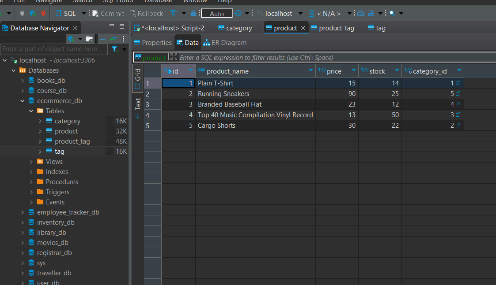
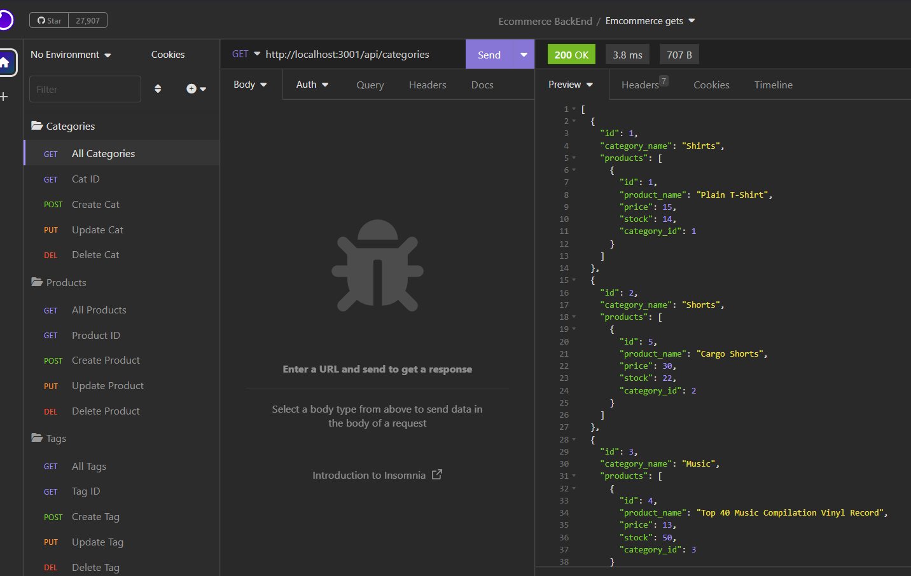

# E_Commerce_BackEnd

## Description
A project to build the back end for an e-commerce site by modifying starter code and configuring a working Express.js API to use Sequelize to interact with a MySQL database.

## Table of Contents (Optional)

- [Usage](#usage)
- [License](#license)
- [Credits](#credits)
- [Questions](#Questions)

## Usage

Clone this GitHub repo to your local machine. Make sure to install all  packages listed in the package.json. These include: express, sequelize, mysql2, and dotenv. Once installed, create the database using the script from the db folder. To seed the database, open the terminal and type "node seeds". Refresh your database to see the updates. To test the CRUD functionality, open your terminal and type "node server.js" and then use Insomnia, Postman, or whatever you prefer to perform get, post, put, and delete requests.

To view a demonstration on how to use the app [click here](https://drive.google.com/file/d/1QOU8U_hQr7dZk63IocnD_dXDc8EEtsrc/view).

## License
To learn more about the license used in this project [click here](https://opensource.org/licenses/MIT).

## Credits
I'd like to thank my instructor, TAs, the Ask BCS staff, and most importantly, my class mates for the positivity and encouragement.  

## Questions
[Click here](https://github.com/emilymclean94) to view my GitHub profile.

